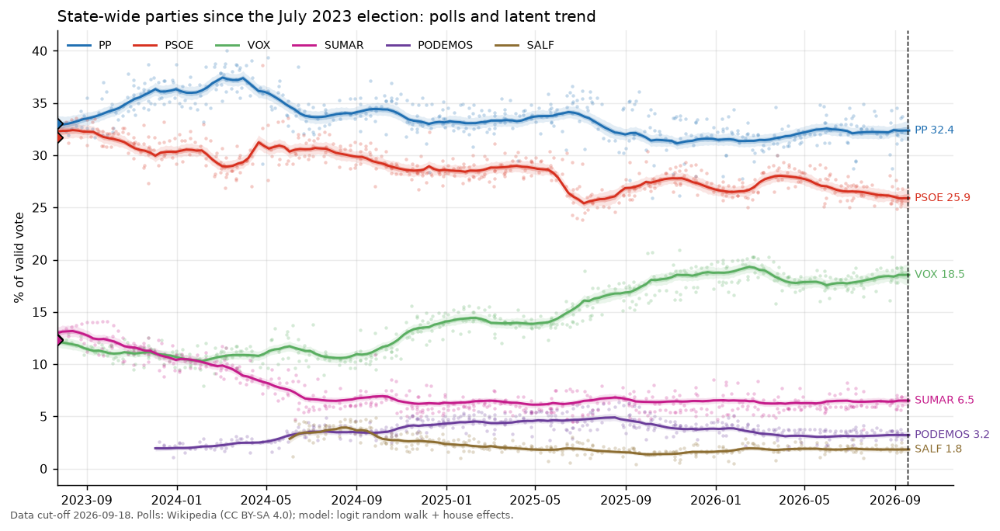
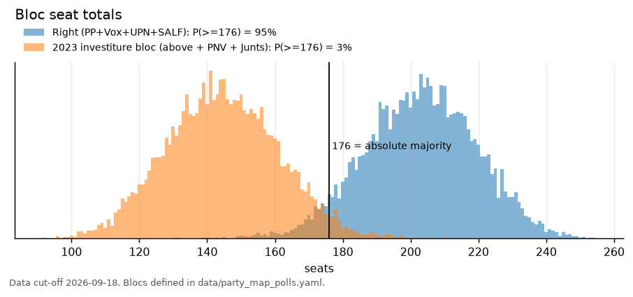
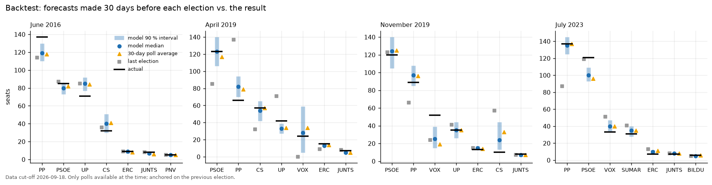

# Forecasting the next Spanish general election

**A Bayesian poll-aggregation and seat-projection model, with a four-election backtest.**

> **Numbers expire.** Everything below is conditional on polls published up to the data cut-off,
> **18 September 2026**. The election must be held by mid-August 2027. Re-run `make all` to refresh.

The 2023 Congreso election produced PP 137 seats, PSOE 121, Vox 33, Sumar 31. This repository turns
the public polling record since then (490 polls, 25 pollsters) and the official results 1977-2023
into a probabilistic forecast, and checks how the same pipeline would have done in 2016, April 2019,
November 2019 and 2023. It started life as an undergraduate Excel/SPSS dossier on Spanish electoral
volatility; the descriptive part of that dossier is reproduced in `reports/figures/`.

## Headline result

**If the election were held at the cut-off**, the model gives PP 32.4 % of the vote (90 % interval
31.3-33.4), PSOE 25.9 % (24.8-27.0) and Vox 18.5 % (17.4-19.8). In seats:

| party | vote share now, 90 % | seats now, 90 % | seats at the legal deadline, 90 % |
|---|---|---|---|
| PP | 31.3 - 33.4 % | 130 - 144 | 107 - 165 |
| PSOE | 24.8 - 27.0 % | 99 - 113 | 78 - 134 |
| Vox | 17.4 - 19.8 % | 59 - 73 | 42 - 92 |
| Sumar | 6.0 - 7.1 % | 6 - 12 | 4 - 21 |
| Podemos | 2.9 - 3.6 % | 2 - 4 | 0 - 6 |
| ERC / Bildu / PNV / Junts | 1-2 % each | 6-9 / 6-8 / 4-6 / 3-6 | 6-11 / 5-9 / 3-6 / 2-7 |

| event | if held now | projected to Aug 2027 |
|---|---|---|
| PP + Vox (+ UPN, SALF) reach 176 seats | > 99 % | 95 % |
| PP largest party | > 99 % | 84 % |
| 2023 investiture bloc (PSOE + Sumar + Podemos + ERC + Bildu + BNG + CC + PNV + Junts) reaches 176 | < 1 % | 3 % |
| PP alone reaches 176 | < 1 % | 1 % |
| Vox above 50 seats | > 99 % | 86 % |

The "now" columns carry only the uncertainty of where opinion stands today plus provincial swing
noise. The deadline columns add eleven months of random-walk drift **and** an election-day polling
error calibrated on the backtest (see below). The gap between the two columns is the size of what
polls cannot tell you a year out.

## Three figures


*Latent vote share (median, 50 % and 90 % bands) and every poll since July 2023. The dashed line is the cut-off.*


*Seat totals for the two competing blocs, projected to the legal deadline.*


*What the same pipeline would have said 30 days before each of the last four elections, against the result.*

## Methods

| component | choice | code |
|---|---|---|
| Results | Ministerio del Interior fixed-width files, all 16 elections, 52 provinces; D'Hondt reproduces the official 2019 and 2023 seats exactly (tested) | `mir.py`, `seats.py`, `tests/` |
| Polls | Wikipedia opinion-polling wikitext (CC BY-SA 4.0), 2,102 polls Dec 2015 - Sep 2026; rowspan/reference-aware parser; CIS enters through its rows | `wiki_polls.py` |
| Party mapping | per-election Ministry codes and Wikipedia labels to canonical ids and blocs; lineage rules for Podemos/UP/Sumar and CiU/Junts | `data/party_map_*.yaml`, `docs/party_mapping.md` |
| Aggregator | weekly logit-scale random walk per party, anchored on the 2023 result; hierarchical house effects centred on publishing pollsters; binomial + excess noise; Sumar break at the Podemos split; NUTS (nutpie), 4 x 1,000 draws | `model.py` |
| Seats | proportional swing from 2023 provincial shares + log-normal provincial noise (sd 0.13, calibrated on the last two transitions); 3 % threshold; Ceuta/Melilla plurality; 10,000 simulations | `seats.py`, `project_seats.py` |
| Backtest | refit 30 days before 2016, Apr-2019, Nov-2019, 2023 with only earlier polls; vote MAE, CRPS, 90 % coverage, seat MAE, Brier; two naive baselines | `backtest.py` |
| Deadline | random-walk extrapolation; mean reversion and error inflation are *tested on the backtest* and used only if they help | `forecast.py` |
| Descriptive | turnout, Laakso-Taagepera ENP, Pedersen volatility split within/between blocs, bloc matrix, provincial fragmentation | `indices.py`, `descriptive.py` |

## Backtest scorecard (mean over the four elections, forecasts made 30 days out)

| method | vote MAE (pp) | vote CRPS (pp) | 90 % vote coverage | seat MAE | 90 % seat coverage | Brier (two events) |
|---|---|---|---|---|---|---|
| **this model** | **1.06** | **0.91** | 40 % | **4.5** | 76 % | **0.06** |
| 30-day poll average | 1.17 | 1.17 | n/a | 5.0 | n/a | 0.13 |
| last election result | 2.59 | 2.59 | n/a | 11.0 | n/a | 0.25 |

In words:

* The model beats both baselines on every point-accuracy score, but the margin over a plain
  30-day poll average is small (0.1 pp of vote, half a seat per party). Most of the value is in the
  house-effect correction and the intervals, not in the trend smoothing.
* **The intervals are too narrow.** At 30 days out the 90 % vote intervals covered only 40 % of the
  outcomes (seats: 76 %). The main culprit is July 2023, when every pollster underestimated PSOE by
  about 5 pp and the model, following them, gave a 66 % chance to a PP + Vox majority that did not
  happen. Polls share their errors; a model that treats the average pollster as unbiased inherits
  them. This is why the deadline projection adds an election-day error term (12 % of each party's
  share, the smallest value that would have restored 90 % coverage in the backtest).
* Mean reversion toward the previous result ("fundamentals") was tested with weights 0.1-0.3 and
  made the 30-day forecasts worse in three of four elections; it is not used. At the 11-month
  horizon that is an open question the backtest cannot settle.
* Where it fails: sudden late movements (Vox doubling in the last month of the November 2019
  campaign; Cs collapsing) and any election with a common polling bias.

Full per-election table: `outputs/backtest_scorecard.csv` and `outputs/backtest_details.csv`.

## What drives the uncertainty

Seat standard deviation for PP when sources are added one at a time (`outputs/uncertainty_decomposition.csv`):
today's posterior 3.2 seats, plus provincial swing noise 4.4, plus eleven months of drift 11.1,
plus election-day polling error 17.6. For the large parties the future dominates the present by a
factor of six in variance; for the regional parties near the 3 % district threshold, provincial
swing noise is the largest single source. The bloc-majority probability moves far less than any
party's seats because Spanish volatility is mostly *within* blocs.

## Descriptive findings (the upgraded dossier)

* Fragmentation peaked in 2019 (effective number of parties 5.8 by votes) and fell back to 4.1 in 2023.
* Volatility is mostly *within* blocs: the two largest shocks (1982, 42 pp; 2015, 32 pp) moved voters
  between parties of the same side. The left/right balance is much more stable than any party's share.
* The peripheral vote is 7 % nationally but 22-54 % in the Basque, Navarrese and Catalan provinces,
  where national polls say least and investitures are decided.

## How to run

Requires [uv](https://docs.astral.sh/uv/) (it fetches Python 3.12). No C compiler needed.

```bash
uv sync --extra dev
make all          # data -> tests -> descriptive -> aggregate -> seats -> backtest -> forecast -> report
```

Individual phases: `uv run electoral build-data | descriptive | aggregate | seats | backtest | forecast | report`.
The aggregator takes about five minutes; the backtest about twenty (per-cycle results are cached in
`outputs/backtest/`). Seeds and dates live in `config.yaml`; every output is stamped with the cut-off.

Outputs for other projects: `outputs/poll_average_daily.csv` (daily latent share per party with
quantiles), documented in `docs/outputs.md`. Interactive version: `docs/index.html`.

## Repository

```
config.yaml            dates, seed, sources, model and backtest settings
data/party_map_*.yaml  party lineage and bloc definitions (edit here to disagree)
data/processed/        tidy datasets + DATA_DICTIONARY.md + DATA_QUALITY.md
src/electoral/         mir, wiki_polls, build_data, indices, model, seats, backtest, forecast, plots, report
tests/                 D'Hondt (incl. exact reproduction of official seats), parser, indices, model helpers
outputs/               poll average, house effects, seat draws, scorecard, diagnostics (traces gitignored)
reports/figures/       all figures; docs/methods_note.md is the write-up; docs/index.html the interactive page
```

## Limitations

* **Common polling error is the dominant risk** and is only handled by an ad-hoc inflation term
  calibrated on four elections. Twenty party-election residuals is a thin basis.
* **No provincial polls.** Seats come from a swing assumption with calibrated noise; parties
  concentrated in one region (Junts, Aliança Catalana, Podemos in Madrid) are where it bites.
* **Untracked lists** (UPN, CUP, Aliança, Adelante Andalucía) keep their 2023 share; Aliança could
  win Catalan seats the model cannot see.
* **Wikipedia is the poll source.** Its editors decide what counts as a poll and how to harmonise
  releases; one panel (EM-Analytics) is a third of all polls, so its house effect matters.
* **Parties are modelled independently** on the logit scale; the seat model renormalises. The random
  walk's innovation variance is estimated in-sample and extrapolated eleven months.
* Turnout is not modelled; shares are of the valid vote.

## Data sources and licences

* Ministerio del Interior, *infoelectoral.interior.gob.es*, files `02YYYYMM_TOTA.zip`. Reuse under
  Ley 37/2007 and RD 1495/2011. *Origen de los datos: Ministerio del Interior.*
* English Wikipedia, "Opinion polling for the [2016 / April 2019 / November 2019 / 2023 / next]
  Spanish general election" and the 2019-2022 sub-pages, CC BY-SA 4.0. CIS barometers appear through
  those tables; *Fuente: Centro de Investigaciones Sociológicas*.

## Author

Kristiyan Pandas, [github.com/kristiyanpanda](https://github.com/kristiyanpanda). BA Sociology, MSc Data
Analytics. Interactive version of the results: `docs/index.html`.

## Resumen en español

Modelo bayesiano de agregación de encuestas (paseo aleatorio semanal en escala logit, efectos de casa
por encuestadora, anclado en el resultado de 2023) y proyección de escaños por D'Hondt en las 52
circunscripciones con 10.000 simulaciones. Con datos hasta el 18-09-2026, el PP obtendría 130-144
escaños y PP+Vox superarían los 176 con probabilidad superior al 99 % si se votara hoy, y del 95 %
proyectado a agosto de 2027. El backtest sobre 2016, abril y noviembre de 2019 y 2023 muestra un
error medio de 1,1 puntos en voto (mejor que la media simple de encuestas y que el último resultado),
pero intervalos demasiado estrechos por el sesgo común de las encuestas en 2023; por eso la
proyección a la fecha límite incorpora un error electoral calibrado. Todo es reproducible con `make all`.
